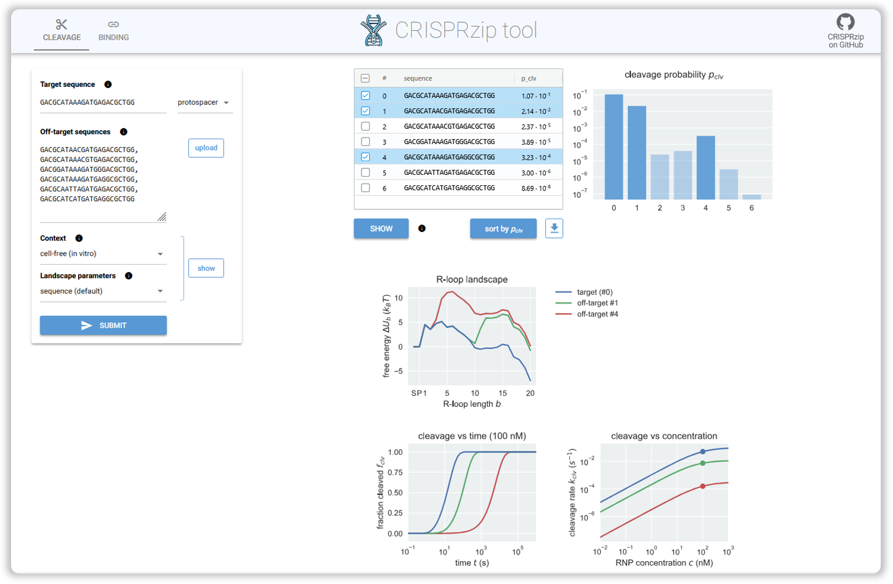
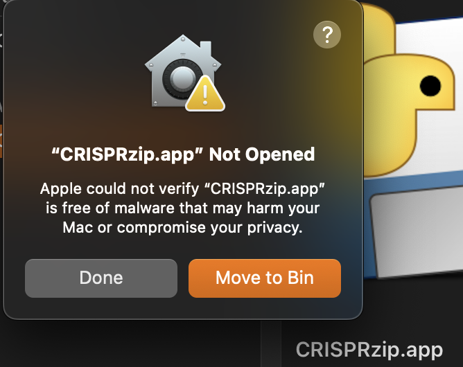
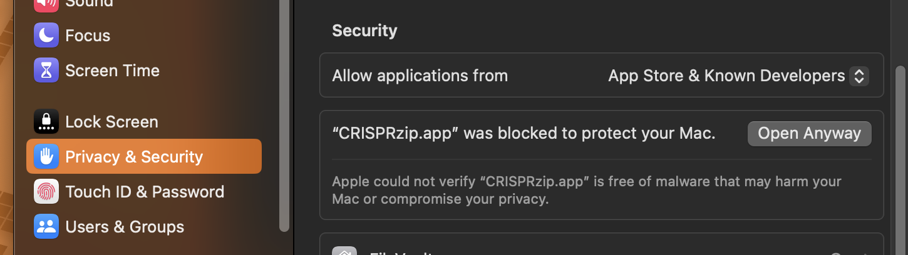
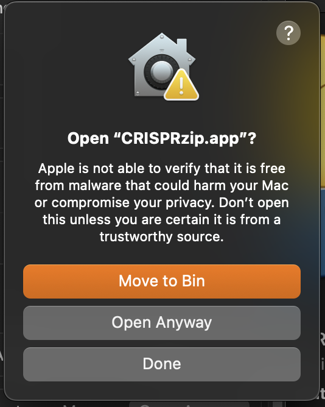
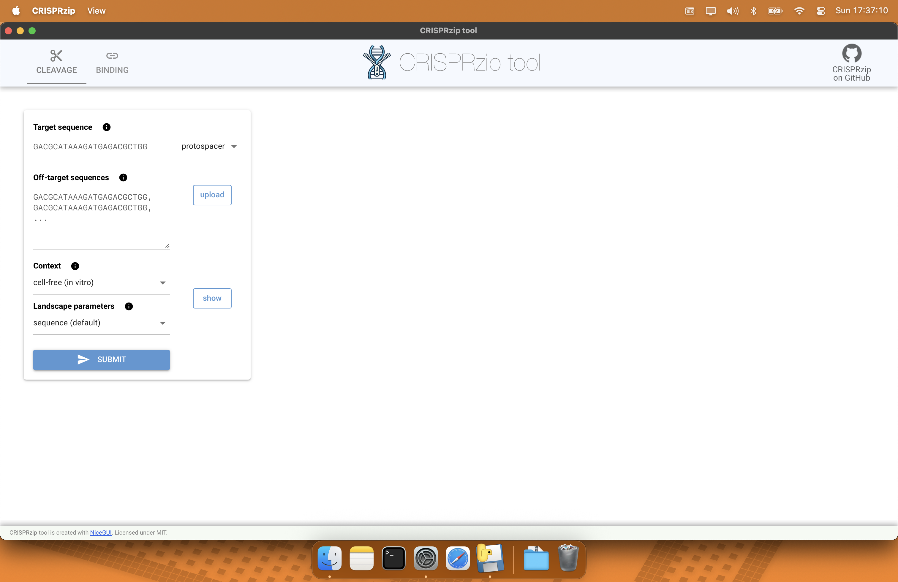
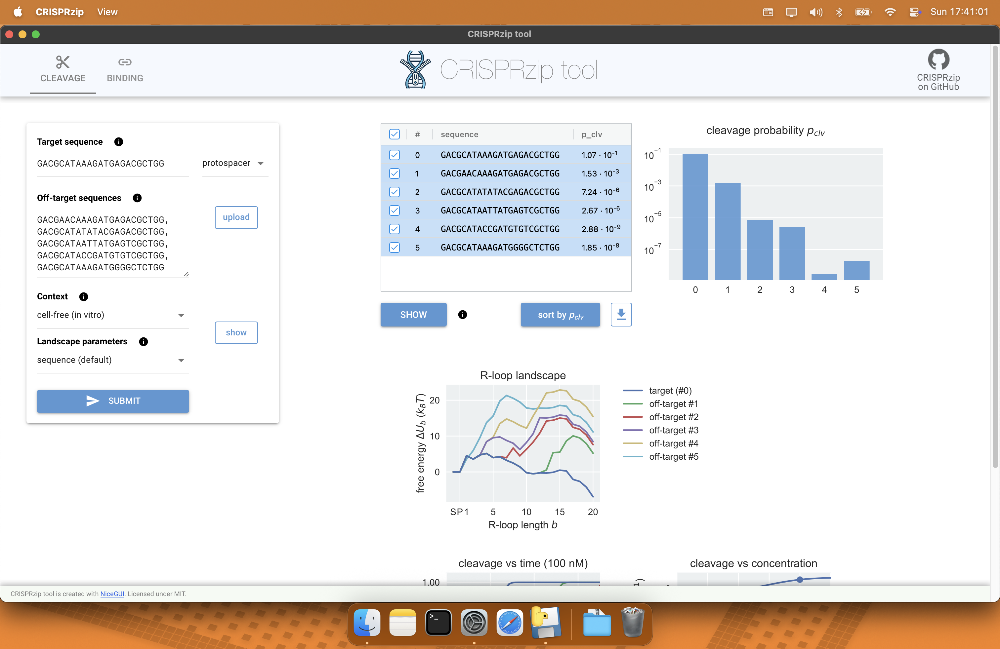

# CRISPRzip tool
[](https://opensource.org/licenses/MIT)

Welcome to the codebase of the **CRISPRzip tool** from the [Depken Lab](https://depkenlab.tudelft.nl/) at TU
Delft.



## About the project
### The CRISPRzip model
CRISPRzip is a physics-based model to study the target 
recognition dynamics of CRISPR-associated nucleases like Cas9
([Eslami-Mossalam, 2022](#references)). Their interactions with target DNA is represented 
as an energy landscape, with which you can simulate binding and cleavage
kinetics. The parameters have been obtained by machine learning on 
high-throughput data. CRISPRzip makes quantitative predictions of on-target 
efficiency and off-target risks of different guide RNAs. With CRISPRzip, we hope 
to contribute to assessing
the risks that come with particular choices in CRISPR application, and as such
contribute to the development of safe gene editing technology.

### The tool
With the CRISPRzip tool/GUI, you can apply CRISRPzip to the sequences of your 
interest without having to do any programming. It's a matter of installing the
right executable for your computer (Windows/Mac/Linux) and launching it.

The CRISPRzip tool is powered by [NiceGUI](https://nicegui.io/) and 
[PyInstaller](https://pyinstaller.org/en/stable/).

### The Python package
If you are familiar with Python and would like to work with the source code:
good news! It's available as a public [GitHub project](https://github.com/hiddeoff/crisprzip)
and as Python package on [PyPi](https://pypi.org/project/crisprzip/). 

### References
Eslami-Mossallam B et al. (2022) *A kinetic model predicts SpCas9 activity,
improves off-target classification, and reveals the physical basis of
targeting fidelity.* Nature Communications.
[10.1038/s41467-022-28994-2](https://doi.org/10.1038/s41467-022-28994-2)

## Usage
You can download the latest version of the CRISPRzip tool from the 
[Releases page](https://github.com/hiddeoff/crisprzip-tool/releases).
Download and follow the user instructions below.

#### Available platforms
| Platform and file |
|---------------|
| [CRISPRzip tool for Windows](https://github.com/hiddeoff/crisprzip-tool/releases/download/latest/crisprzip-tool-win) |
| [CRISPRzip tool for macOS](https://github.com/hiddeoff/crisprzip-tool/releases/download/latest/crisprzip-tool-macos) |
| [CRISPRzip tool for Linux](https://github.com/hiddeoff/crisprzip-tool/releases/download/latest/crisprzip-tool-unix)  |

### User instructions

<details>
  <summary>Windows</summary>

  - **Instructions for Windows**

</details>

<details>
  <summary>macOS</summary>

1. Download the macOS file an unzip it. You should see a file named `CRISPRzip.app`.

*Note: The file extension may not be visible if your system is set to hide extensions.*

2. Double-click on the `CRISPRzip.app` file. You will see a message like this:



This message is expected. Apple displays this warning for applications that are not distributed through the Mac App Store or not notarized by their developer program. Notarization requires an annual developer fee of 99 EUR. Rest assured, this does not indicate a problem with the application itself, but is a standard part of Apple’s security measures for software from outside the App Store.

3. To proceed, open your "System Settings", go to "Privacy & Security", scroll down, and you will see this message:



click on "Open Anyway".

4. You will be then prompted with this window when opening the CRISPRzip tool:



click on "Open Anyway".

5. Enter your password.


6. CRISPRzip tool will now run as a standard app, and you will not need to repeat these steps for future launches.




</details>

<details>
  <summary>Linux</summary>

  - **Instructions for Linux**

</details>

### Browser NiceGUI application
As an alternative to the downloadable applications, you could clone this
repository and launch CRISPRzip tool from the terminal. It will open in your
browser. This way to launch the tool is sometimes (a lot) faster than the 
executables. Follow the developer instructions below.

## Developers
To use and develop the GUI, run the following commands:
1. Clone the repository.
```bash
git clone https://github.com/hiddeoff/crisprzip-tool.git
```
2. Navigate to the cloned repository.
3. Create a virtual environment (venv or conda), activate it, and install the required dependencies.
```bash
conda create -n crisprzip_gui python=3.12
conda activate crisprzip_gui
pip install -r requirements.txt
```
4.  Run the GUI. It should launch in your browser.
```bash
python crisprzip_gui.py
```

## Building the executable
If you want to build the executable for the CRISPRzip tool, you can build it with [PyInstaller](https://pyinstaller.org/en/stable/). From the root of the project directory, run the following command for your platform:

<details>
  <summary>Windows</summary>

  - **Instructions for Windows**

</details>

<details>
  <summary>macOS</summary>

```bash
pyinstaller crisprzip_gui.py \
  --name CRISPRzip \
  --windowed \
  --onedir \
  --add-data "/path/to/your/venv/lib/python3.12/site-packages/nicegui:nicegui/static" \
  --add-data "/path/to/your/venv/lib/python3.12/site-packages/latex2mathml:latex2mathml" \
  --collect-all nicegui \
  --collect-all crisprzip \
  --collect-all matplotlib \
  --collect-all numpy \
  --collect-all pandas \
  --hidden-import uvicorn.logging
```
- Important: Replace the paths with the correct ones for your system!

</details>

<details>
  <summary>Linux</summary>

  - **Instructions for Linux**

</details>

These commands will create a `dist` folder containing the executable and a `build` folder with the build files. Alternatively, you can run these commands from the `bin` folder, which contains scripts to build the executable for your platform. Remember to update the paths as needed.

## Contributing
If you would like to contribute to this project: that's great! Have a look at our 
[Contributing guidelines](./CONTRIBUTING.md) and our [Code of Conduct](./CODE_OF_CONDUCT.md).

## Acknowledgements
Many thanks to [Elviss Dvinskis](https://github.com/edvinskis) and 
[Raúl Ortiz](https://github.com/rortizmerino) from the [DCC team at TU Delft](https://www.tudelft.nl/en/library/support/library-for-researchers/setting-up-research/dcc)
for their support to get this GUI released!

## Waiver
Technische Universiteit Delft hereby disclaims all copyright interest in the
program “CRISPRzip tool” written by the Author(s).
Paulien Herder, Dean of Applied Sciences

(c) 2025, Hidde Offerhaus, Delft, The Netherlands.